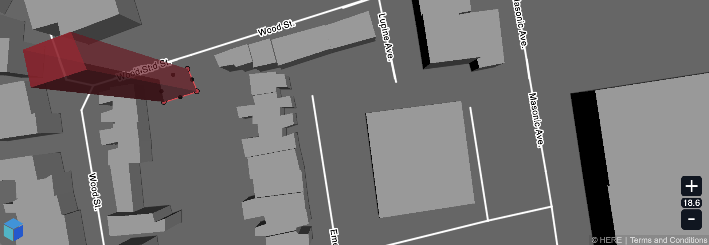

# XYZ Editor JS

XYZ Editor is an experimental and work in progress open-source map editor written in TypeScript/JavaScript.



## Prerequisites

* [Node.js](https://nodejs.org)
* [Yarn](https://yarnpkg.com/en/docs/install)


## Start developing

1. Clone this repository

    ```
    git clone https://github.com/heremaps/xyz-editor.git

    cd xyz-editor
    ```

2. Install node module dependencies
    ```
    yarn install
    ```

3. Watch for sourcecode changes and build dev version
    ```
    yarn run watch-dev
    ```
    Builds are located in `./packages/*/dist/`


## Setup your xyz access token

Running tests / playground and debug pages requires your xyz token to be provided.
* Configure your xyz token
    ```
    yarn run set-access-token YOUR_ACCESS_TOKEN
    ```

## Serve debug page
* Start debug server (requires xyz access token)
    ```
    yarn run server
    ```
    browser will start and open http://localhost:8080/debug automatically


## Serve Playground
* Build and start the playground (requires xyz access token)
    ```
    yarn run playground
    ```
    browser will start and open http://localhost:8081/packages/playground/dist automatically


## Other

* test release build `yarn run test`

* build dev version once `yarn run build-dev` (located in packages/*/dist/)

* build release version only `yarn run build-release` (minified...)

* build the documentation `yarn run build-doc` (located in packages/docs/dist/)

* create full release bundle `yarn run bundle-release` (includes documentation and playground)

* configure XYZ access token `yarn run set-access-token YOUR_ACCESS_TOKEN`


## Guides

* [Getting started](https://github.com/heremaps/xyz-editor/wiki/Getting-started)
* [Display your space](https://github.com/heremaps/xyz-editor/wiki/Display-your-space)
* [Style your data](https://github.com/heremaps/xyz-editor/wiki/Style-your-data)
* [Add interactivity](https://github.com/heremaps/xyz-editor/wiki/Add-interactivity)


## License

Copyright (C) 2019 HERE Europe B.V.

This project is licensed under the Apache License, Version 2.0 - see the [LICENSE](LICENSE) file for details
